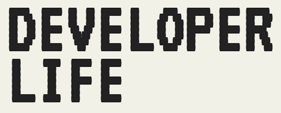
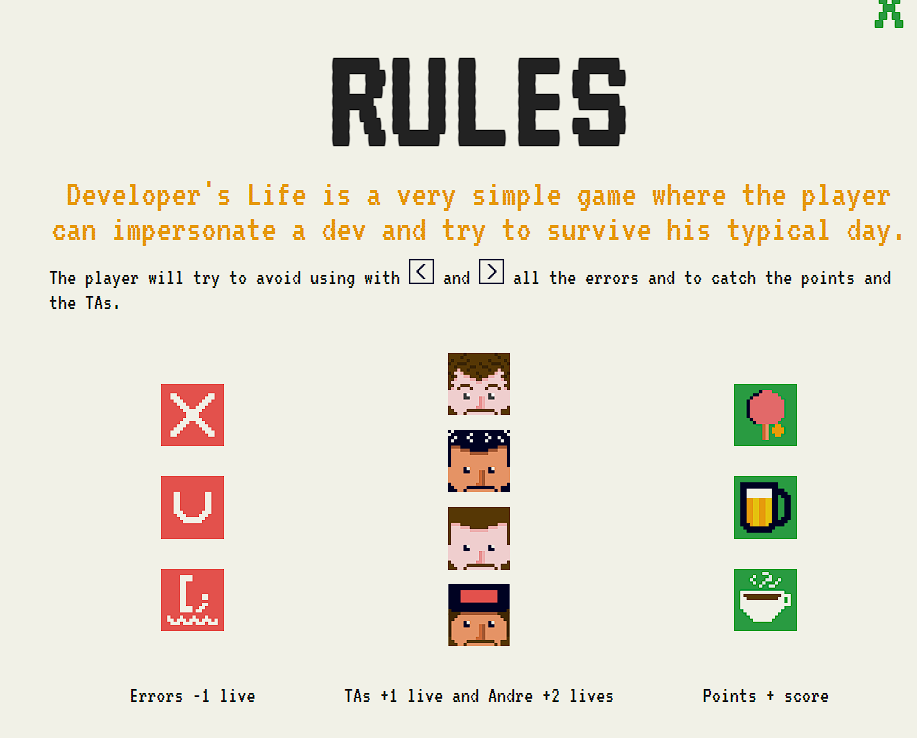
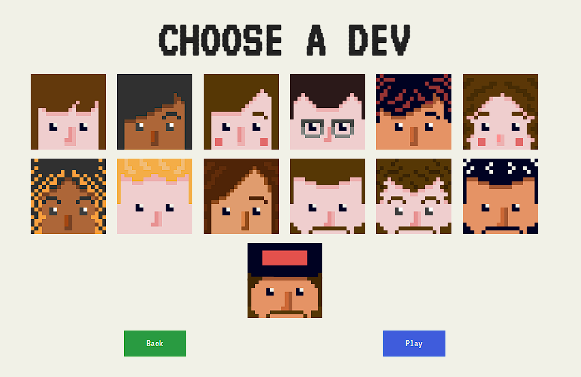
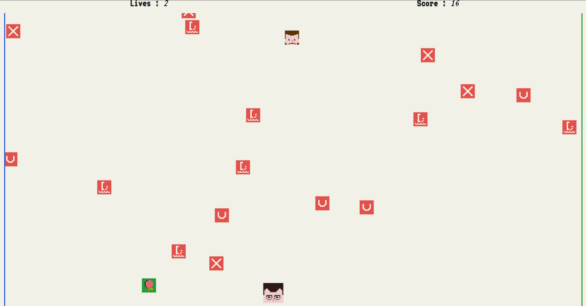
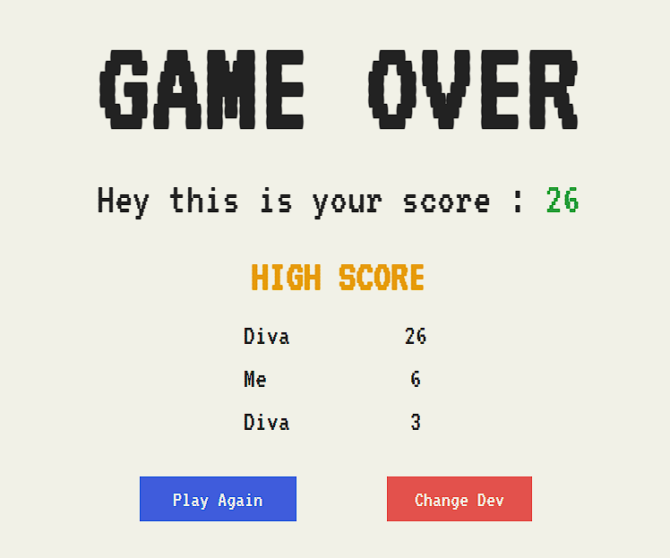
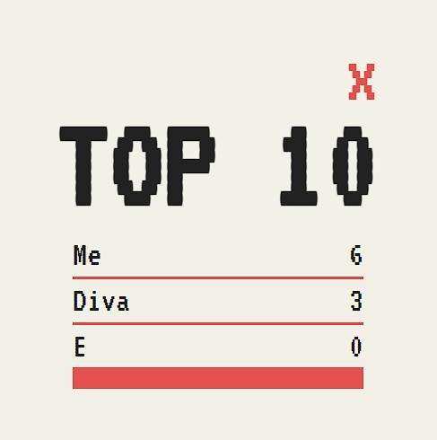

Developer's Life is a very simple game where the player can impersonate a dev and try to survive his typical day.
The player will try to avoid all the enemies and catch the things that will give him points.
The player will be able to choose what characters he wants to play with.
In the first level, the player will have one type of enemy and a type of point, but in the next level, every character is going to have different enemies and different points and good NPS that will add him life.
There's no winning condition but the losing condition is: no more lives.

---

### 🖼Overview🖼

---

### ⚙Compile⚙

This project uses SCSS. Use the following line to compile to CSS while you're coding :

`node-sass --output-style compressed --source-map true --watch style.scss style.css`

---
